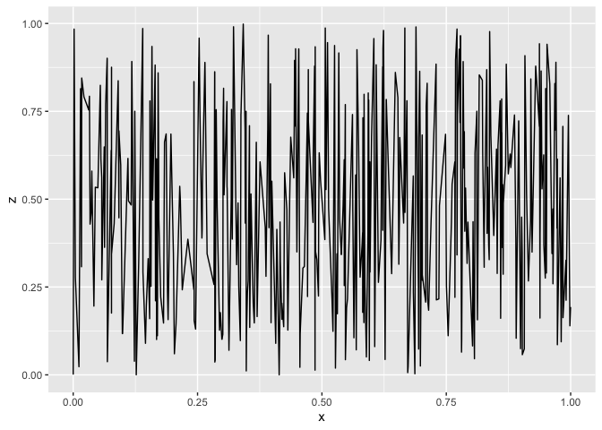

RMarkdown for Git
================
Mona Matsumoto-Ryan
1/27/2020

What does this look like?

``` r
randu # random nums df
```

``` r
library(ggplot2)

randu_plot <- ggplot(data=randu, aes(x=x, y=z))+
  geom_line()
```

<!-- -->
